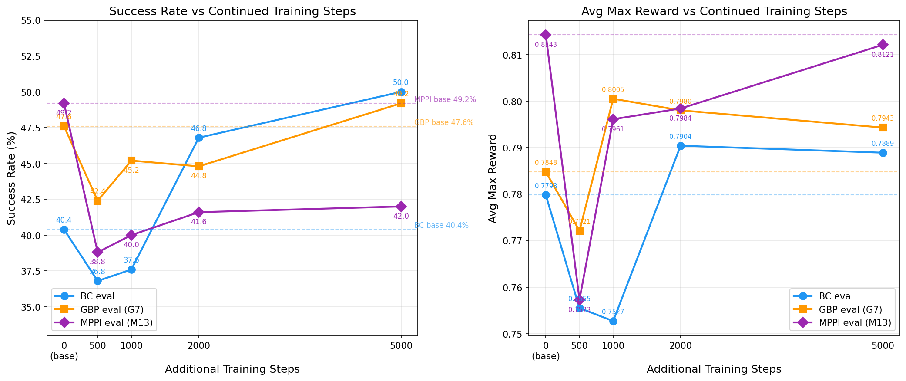

# Finetune on Pretrain Data: Continuation of Training Probe

## Research Question

How does continued training (finetuning on the pretrain dataset itself) affect evaluation performance under BC, GBP planning, and MPPI planning? This is a probe to understand whether additional training steps beyond the 100K pretrain checkpoint improve, maintain, or degrade performance — and how each eval method responds differently.

## Methodology

- **Base checkpoint**: `outputs/act_simple_awm_pusht_wm1.0_l2norm_truly_deterministic/checkpoints/last/pretrained_model` (100K steps, lr=1e-5, bs=32)
- **Settings**: `FINETUNE_ONLY=True` (no on-policy data collection), `FINETUNE_LR=None` (keeps pretrain lr=1e-5), `BATCH_SIZE=32`
- **Evaluation**: 250 episodes, seed=42, three eval modes:
  - **BC eval**: no planning (P1-P4)
  - **GBP eval**: optimal G7 parameters from planning sweep: `lr=0.3, n_iters=10, action_cost=0.1` (P5-P8)
  - **MPPI eval**: optimal M13 parameters from planning sweep: `k=64, ni=5, std=0.3, temp=0.05, decay=0.5` (P9-P12)
- **Runs**: 500, 1000, 2000, 5000 additional training steps x 3 eval modes = 12 experiments
- **Baselines**: BC = 40.4%, GBP G7 = 47.6%, MPPI M13 = 49.2% (all on unfinetuned checkpoint)
- **Execution prompt**: `prompt_run_and_eval.md`
- **Branch**: `self-improvement-v2-experiments`
- **Compute**: `compute_rtx6000.sh` (RTX 6000, 48GB)
- **Determinism**: All runs fully deterministic (P2 ft1000 reproduced exactly 37.6% matching a prior run)

## Results

### BC Eval (P1-P4)

| Experiment | Finetune Steps | Total Steps | Commit | pc_success | avg_max_reward | eval_ep_s |
|---|---|---|---|---|---|---|
| BC Baseline | 0 | 100,000 | 016b8fbd | 40.4% | 0.7798 | 0.860 |
| P1 | 500 | 100,500 | dfd47f24 | 36.8% | 0.7555 | 1.134 |
| P2 | 1,000 | 101,000 | 45f14de2 | 37.6% | 0.7527 | 1.139 |
| P3 | 2,000 | 102,000 | 0616d511 | **46.8%** | **0.7904** | 1.125 |
| P4 | 5,000 | 105,000 | b1dc2703 | **50.0%** | 0.7889 | 1.120 |

### GBP Eval — G7 params (P5-P8)

| Experiment | Finetune Steps | Total Steps | Commit | pc_success | avg_max_reward | eval_ep_s |
|---|---|---|---|---|---|---|
| GBP Baseline | 0 | 100,000 | 6c6649c4 | 47.6% | 0.7848 | 5.802 |
| P5 | 500 | 100,500 | 9d292952 | 42.4% | 0.7721 | 5.851 |
| P6 | 1,000 | 101,000 | 6b423723 | 45.2% | 0.8005 | 5.988 |
| P7 | 2,000 | 102,000 | 155811e3 | 44.8% | 0.7980 | 5.745 |
| P8 | 5,000 | 105,000 | a979f8f6 | **49.2%** | 0.7943 | 5.880 |

### MPPI Eval — M13 params (P9-P12)

| Experiment | Finetune Steps | Total Steps | Commit | pc_success | avg_max_reward | eval_ep_s |
|---|---|---|---|---|---|---|
| MPPI Baseline | 0 | 100,000 | c7227bf1 | 49.2% | 0.8143 | 2.438 |
| P9 | 500 | 100,500 | be3930e5 | 38.8% | 0.7573 | 2.350 |
| P10 | 1,000 | 101,000 | 66c89b70 | 40.0% | 0.7961 | 2.454 |
| P11 | 2,000 | 102,000 | 992749e5 | 41.6% | 0.7984 | 2.429 |
| P12 | 5,000 | 105,000 | 4ba12e79 | 42.0% | 0.8121 | 2.458 |

### Combined View

| Finetune Steps | BC eval | GBP eval | MPPI eval | BC delta | GBP delta | MPPI delta |
|---|---|---|---|---|---|---|
| 0 (baseline) | 40.4% | 47.6% | 49.2% | -- | -- | -- |
| 500 | 36.8% | 42.4% | 38.8% | -3.6pp | -5.2pp | **-10.4pp** |
| 1,000 | 37.6% | 45.2% | 40.0% | -2.8pp | -2.4pp | -9.2pp |
| 2,000 | **46.8%** | 44.8% | 41.6% | +6.4pp | -2.8pp | -7.6pp |
| 5,000 | **50.0%** | **49.2%** | 42.0% | **+9.6pp** | +1.6pp | -7.2pp |

## Key Findings

- **BC eval shows a clear U-shaped curve**: Performance drops from 40.4% to ~37% at 500-1000 steps, then recovers strongly, reaching 50.0% at 5000 steps (+9.6pp over baseline). The 100K checkpoint was not fully converged.

- **GBP eval shows a milder dip and slower recovery**: GBP drops -5.2pp at 500 steps but recovers to baseline by 5000 steps (49.2% = GBP baseline 47.6% + 1.6pp). The recovery is muted compared to BC.

- **MPPI is the most sensitive to continued training**: MPPI suffers the largest degradation (-10.4pp at 500 steps) and barely recovers even at 5000 steps (42.0% vs 49.2% baseline, still -7.2pp). MPPI's performance remains well below its unfinetuned baseline across all step counts tested.

- **BC overtakes both planning methods by 2000 steps**: At 2000 steps, BC (46.8%) exceeds both GBP (44.8%) and MPPI (41.6%). At 5000 steps, BC (50.0%) beats GBP (49.2%) and far exceeds MPPI (42.0%). Planning adds value primarily when the base policy is weaker.

- **MPPI and GBP respond oppositely to continued training**: GBP gradually recovers, while MPPI remains stuck. This suggests the world model representations that MPPI relies on are more fragile to continued training than those used by GBP. The world model may be "forgetting" features that MPPI's sampling-based optimization needs, while GBP's gradient-based approach is more robust.

- **avg_max_reward tells a different story for MPPI**: Despite low success rates, MPPI's avg_max_reward recovers substantially (0.7573 at 500 steps -> 0.8121 at 5000 steps, near the 0.8143 baseline). This means the policy is getting closer to succeeding on many episodes but not crossing the success threshold — MPPI may be destabilizing trajectories that would otherwise succeed under BC.

- **Determinism confirmed**: P2 (ft1000 BC) exactly reproduced the prior run (952b860) at 37.6%/0.7527.

## Conclusions

1. **The 100K checkpoint is not fully converged.** Continuing training on the same pretrain dataset for 5000 more steps improves BC from 40.4% to 50.0%. Any self-improvement experiment should use this as the baseline, not the 100K checkpoint.

2. **The initial dip at 500-1000 steps explains prior degradation.** Earlier self-improvement experiments that finetuned for 500-1000 steps were in the "dip zone." Their poor performance was likely due to insufficient training, not bad on-policy data.

3. **Planning helps weak policies more than strong ones.** At baseline, MPPI adds +8.8pp and GBP adds +7.2pp over BC. At 5000 steps, BC surpasses both. Planning is a complement to a weaker policy, not a boost to a strong one.

4. **MPPI is fragile to model changes.** Even continued training on the *same* data degrades MPPI by -7.2pp at 5000 steps, while BC improves by +9.6pp. This has critical implications for self-improvement: if on-policy finetuning damages MPPI even further, planning-based data collection and evaluation may become counterproductive. GBP is more robust but still underperforms BC at higher step counts.

5. **Further training warranted.** BC is still rising at 5000 steps. Follow-up at 10K and 20K steps would clarify the plateau and whether MPPI ever recovers.

## Stopping Rationale

The 12 experiments (4 step counts x 3 eval modes) provide a comprehensive answer: continued pretraining improves BC substantially, partially recovers GBP, but actively hurts MPPI. The three eval methods respond to the same model change in qualitatively different ways, which is itself an important finding for self-improvement strategy. The patterns are clear and no additional experiments are needed at this stage.
