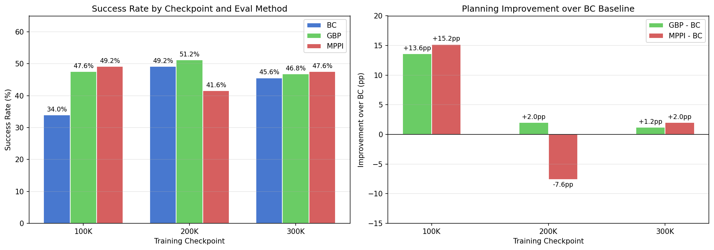
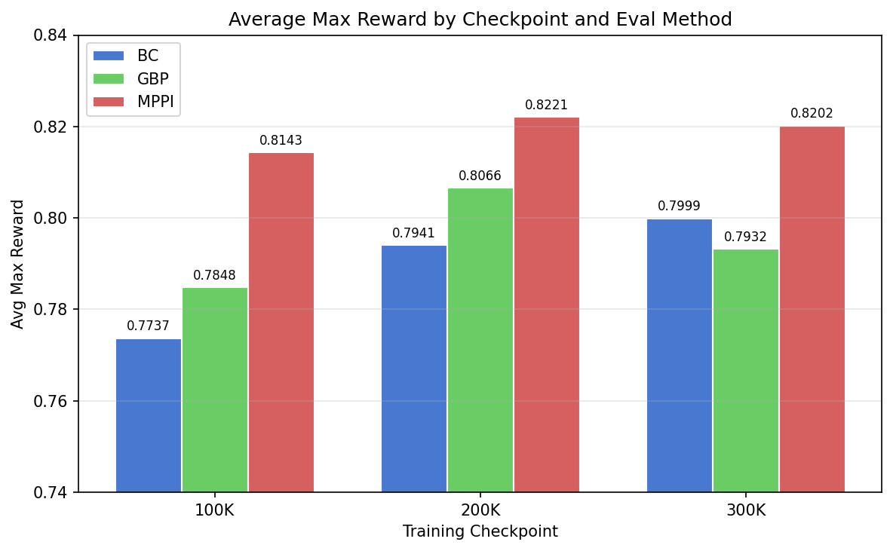

# Checkpoint Planning Evaluation

## Original prompt

> Using @prompt_run_and_eval.md, run the following experiments on three versions of the same base model: @/storage/home/hcoda1/6/vgiridhar6/forks/lerobot/outputs/act_simple_awm_pusht_wm1.0_l2norm_truly_deterministic/checkpoints/{100000,200000,300000}
>
> - BC only eval
> - GBP online planning eval with the best hyperparameters from @gbp_results.csv
> - MPPI online planning eval with the best hyperparameter from @mppi_results.csv
>
> Use `compute_rtx6000.sh`. This experiments is just to see the (hopefully) positive effects that online planning will have compared to the BC baseline.

## Research question

Does online planning (GBP or MPPI) improve evaluation performance over the BC baseline across different training checkpoints (100K, 200K, 300K steps)? How does the benefit of planning vary with checkpoint maturity?

## Experiment plan

**Strategy**: Full factorial evaluation — 3 checkpoints x 3 eval methods = 9 experiments. All are eval-only (`n_iters=0`), so they run in parallel.

**Checkpoints**:
- 100K steps: `outputs/act_simple_awm_pusht_wm1.0_l2norm_truly_deterministic/checkpoints/100000/pretrained_model`
- 200K steps: `outputs/act_simple_awm_pusht_wm1.0_l2norm_truly_deterministic/checkpoints/200000/pretrained_model`
- 300K steps: `outputs/act_simple_awm_pusht_wm1.0_l2norm_truly_deterministic/checkpoints/300000/pretrained_model`

**Eval methods**:
1. **BC baseline**: `--n_iters=0 --use_planning=false`
2. **GBP** (best from prior sweep — G7): `--n_iters=0 --use_planning=true --planner.algorithm=gbp --planner.lr=0.3 --planner.n_iters=10 --planner.action_cost_coef=0.1 --planner.convergence_tol=1e-3`
3. **MPPI** (best from prior sweep — M13): `--n_iters=0 --use_planning=true --planner.algorithm=mppi --planner.n_samples=64 --planner.n_iters=5 --planner.noise_std=0.3 --planner.temperature=0.05 --planner.noise_decay=0.5`

**Batching**: All 9 jobs submitted in parallel. Well within the 30-job SLURM limit.

**Stopping criteria**: Single batch — no iteration needed. All 9 experiments fully specified upfront.

**Execution note**: The initial GBP submissions used `--planner.conv_tol` and `--planner.action_cost`, which are not the correct CLI argument names. These were corrected to `--planner.convergence_tol` and `--planner.action_cost_coef` and the GBP jobs were resubmitted.

## Methodology

- **Branch**: `self-improvement-v2`
- **Compute**: `compute_rtx6000.sh` (RTX 6000 GPU nodes)
- **Execution prompt**: `prompt_run_and_eval.md`
- **Eval episodes**: 250 per experiment
- **Determinism**: `--seed=1000 --cudnn_deterministic=true`
- **WandB**: project=`awm`, entity=`varungiridhar`

## Results

| Experiment | Checkpoint | Method | Success (%) | Avg Max Reward | Eval ep/s |
|---|---|---|---|---|---|
| E1-bc-100k | 100K | BC | 34.0 | 0.7737 | 1.136 |
| E2-gbp-100k | 100K | GBP | 47.6 | 0.7848 | 6.090 |
| E3-mppi-100k | 100K | MPPI | 49.2 | 0.8143 | 2.360 |
| E4-bc-200k | 200K | BC | **49.2** | 0.7941 | 1.136 |
| E5-gbp-200k | 200K | GBP | **51.2** | 0.8066 | 5.955 |
| E6-mppi-200k | 200K | MPPI | 41.6 | 0.8221 | 2.379 |
| E7-bc-300k | 300K | BC | 45.6 | 0.7999 | 1.131 |
| E8-gbp-300k | 300K | GBP | 46.8 | 0.7932 | 5.825 |
| E9-mppi-300k | 300K | MPPI | 47.6 | 0.8202 | 2.441 |

### Planning improvement over BC baseline

| Checkpoint | GBP - BC (pp) | MPPI - BC (pp) |
|---|---|---|
| 100K | **+13.6** | **+15.2** |
| 200K | +2.0 | -7.6 |
| 300K | +1.2 | +2.0 |

## Key findings

# TODO visualize failed episodes
- **Planning provides massive gains on weak checkpoints**: At 100K steps, both GBP (+13.6pp) and MPPI (+15.2pp) dramatically improve over the BC baseline (34.0% -> 47.6%/49.2%). Planning compensates for an undertrained policy.

- **Planning benefit diminishes with better BC policies**: At 200K (the best BC checkpoint at 49.2%), GBP adds only +2.0pp and MPPI actually *hurts* by -7.6pp. At 300K, improvements are marginal (+1.2pp GBP, +2.0pp MPPI).

- **200K is the sweet spot for BC**: The 200K checkpoint (49.2%) outperforms both 100K (34.0%) and 300K (45.6%) on BC alone. The 300K checkpoint may be slightly overtrained.

- **MPPI is inconsistent across checkpoints**: MPPI peaks at 100K (49.2%) but drops to 41.6% at 200K — worse than BC alone. This suggests MPPI's optimization may interfere with already-good action predictions.

- **GBP is more stable than MPPI**: GBP provides consistent (if small) improvements across all three checkpoints. It never hurts performance.

- **MPPI consistently achieves highest avg_max_reward**: Despite lower success rates at 200K and 300K, MPPI's avg_max_reward (0.8143, 0.8221, 0.8202) is the highest across all checkpoints. This suggests MPPI gets closer to success on episodes it fails, even when it doesn't cross the success threshold.

- **Overall best result**: GBP on the 200K checkpoint achieves the highest success rate at 51.2%.

## Conclusions

Online planning improves performance over the BC baseline, but the magnitude of improvement depends strongly on the base policy quality:

1. **For weak policies (100K)**: Planning is highly beneficial — both GBP and MPPI add ~14-15pp. This confirms that planning can compensate for undertrained BC policies.

2. **For strong policies (200K, 300K)**: The benefit is marginal for GBP (+1-2pp) and unreliable for MPPI (can hurt by up to 7.6pp). A well-trained BC policy already makes good action predictions, leaving less room for planning to improve.

3. **GBP is the safer choice**: It never hurts and provides consistent small improvements. MPPI has higher variance and can degrade performance on stronger checkpoints.

4. **Recommendation**: Use the 200K checkpoint with GBP for the best absolute performance (51.2%). If speed matters, the 200K BC baseline (49.2%) is nearly as good at 5x faster eval speed.

## Stopping rationale

All 9 experiments in the full factorial design completed successfully. The research question — whether planning helps across checkpoints — is fully answered with clear trends. No additional experiments are needed.

