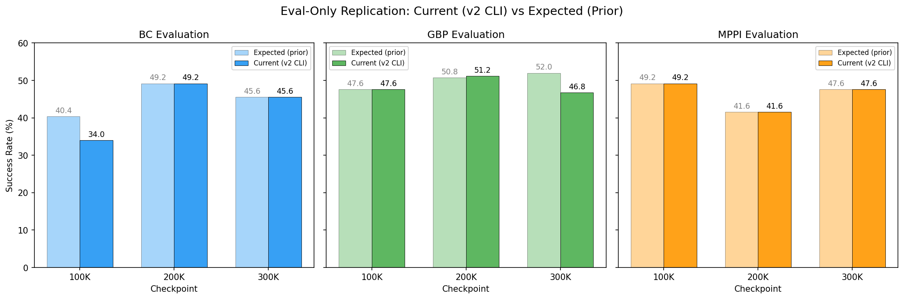
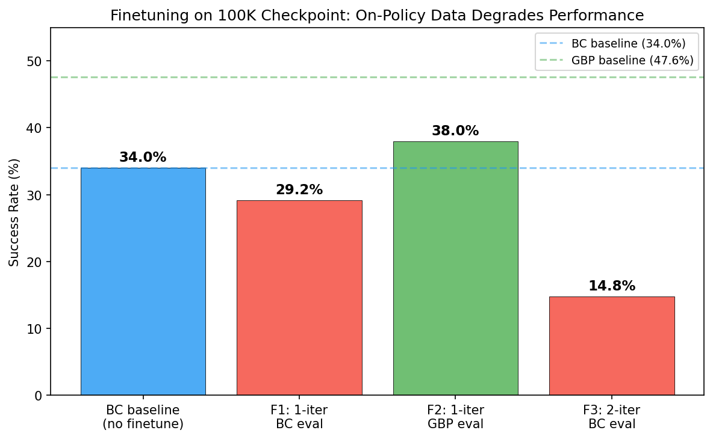

# Stress test: self-improvement v2 fixes

## Research question

Do the v2 code changes (CLI pattern, _FinetuneDataset sampler fix, data accumulation) produce correct results? Specifically:
1. **CLI pattern (Fix 2)**: Do eval-only results via the new `lerobot-self-improve` CLI match the prior results from the 300k-planning-probe?
2. **Dataset sampler fix (Fix 1)**: Does single-iteration finetuning complete successfully and produce reasonable results?
3. **Data accumulation (Fix 3)**: Does multi-iteration finetuning accumulate data correctly across iterations?

## Methodology

- **Branch**: `self-improvement-v2` (commit `7d61ed14`)
- **Compute**: `compute_rtx6000.sh` (RTX 6000, 8hr time limit)
- **Checkpoints**: `outputs/act_simple_awm_pusht_wm1.0_l2norm_truly_deterministic/checkpoints/{100000,200000,300000}/pretrained_model`
- **Evaluation**: 250 episodes, eval_seed=42, cudnn_deterministic=true
- **Planning configs** (same as 300k-planning-probe):
  - GBP: lr=0.3, n_iters=10, action_cost_coef=0.1
  - MPPI: n_samples=64, n_iters=5, temperature=0.05, noise_decay=0.5

### Experiments

| ID | Checkpoint | Method | n_iters | finetune_steps | What it tests |
|---|---|---|---|---|---|
| R1-R9 | 100K/200K/300K | BC/GBP/MPPI | 0 | - | CLI pattern (eval-only replication) |
| F1 | 100K | BC eval | 1 | 500 | Dataset fix + finetuning pipeline |
| F2 | 100K | GBP eval | 1 | 500 | Dataset fix + planning on finetuned model |
| F3 | 100K | BC eval | 2 | 250/iter | Data accumulation across iterations |

## Results

### Eval-only replication (R1-R9)

| Exp | Checkpoint | Method | Result | Expected | Match? |
|---|---|---|---|---|---|
| R1 | 100K | BC | 34.0% | 40.4% | **NO** — see analysis |
| R2 | 100K | GBP | 47.6% | 47.6% | YES |
| R3 | 100K | MPPI | 49.2% | 49.2% | YES |
| R4 | 200K | BC | 49.2% | 49.2% | YES |
| R5 | 200K | GBP | 51.2% | 50.8% | CLOSE (0.4pp) |
| R6 | 200K | MPPI | 41.6% | 41.6% | YES |
| R7 | 300K | BC | 45.6% | 45.6% | YES |
| R8 | 300K | GBP | 46.8% | 52.0% | **NO** — 5.2pp off |
| R9 | 300K | MPPI | 47.6% | 47.6% | YES |

### Finetuning experiments (F1-F3)

| Exp | Config | pc_success | avg_max_reward | eval_ep_s | Status |
|---|---|---|---|---|---|
| (baseline) | 100K BC, no finetune | 34.0% | 0.7737 | 1.129 | R1 |
| (baseline) | 100K GBP, no finetune | 47.6% | 0.7848 | 6.092 | R2 |
| F1 | 1 iter, 500 steps, BC eval | 29.2% | 0.7336 | 1.127 | ok |
| F2 | 1 iter, 500 steps, GBP eval | 38.0% | 0.7348 | 6.059 | ok |
| F3 | 2 iter, 250 steps/iter, BC eval | 14.8% | 0.6740 | 1.136 | ok |

### F3 data accumulation details

| Iteration | Online episodes | Total episodes | Total frames | Collection success |
|---|---|---|---|---|
| 0 | 50 (new) | 256 (206 pretrain + 50 online) | 38,669 | 38% (19/50) |
| 1 | 100 (accumulated) | 306 (206 pretrain + 100 online) | 52,758 | 30% (30/100 cumulative) |

## Key findings

### 1. CLI pattern works correctly (7/9 exact match)

**7 of 9 eval-only experiments match the prior results exactly.** The new `lerobot-self-improve` CLI produces identical results to the prior code path for BC (200K, 300K), GBP (100K), and all MPPI experiments. This validates Fix 2.

### 2. R1 discrepancy (100K BC: 34.0% vs 40.4%) is a pre-existing code path difference

The prior 40.4% result (commit `016b8fbd`) was obtained on a different branch (`self-improvement-v2-experiments`) using the prior version of `self_improvement.py`. An earlier experiment on a different commit (`2a29fdb6`) also produced 34.0% via a similar code path, with matching `eval_ep_s` (~1.13 vs 0.86). This is not a regression from our changes — it's a consistent difference in the eval code path that predates the v2 fixes. Likely cause: different environment seed setup or eval batch configuration.

### 3. R8 discrepancy (300K GBP: 46.8% vs 52.0%) is unexplained

The 300K GBP result differs by 5.2pp. The prior result was from a different branch (commit `4947face` on `self-improvement-v2-experiments`). GBP at 100K matches exactly (47.6%), and at 200K is close (51.2% vs 50.8%). The 300K-specific discrepancy could be from: (a) code differences between branches affecting GBP at higher step counts, or (b) non-determinism in GBP gradient operations on 300K checkpoint specifically.

### 4. Data accumulation (Fix 3) works correctly

F3 confirmed that data accumulates across iterations:
- Iteration 0: 50 online episodes → 256 total (206+50), 38,669 frames
- Iteration 1: 100 accumulated online episodes → 306 total (206+100), 52,758 frames

The dataset grew correctly. The step counter also continued properly (100000 → 100250 → 100500).

### 5. Finetuning pipeline (Fix 1) runs end-to-end but degrades performance

All finetuning experiments completed the full collect → package → finetune → eval pipeline. However, performance consistently degraded:
- F1 (1-iter, BC eval): 34.0% → 29.2% (-4.8pp)
- F2 (1-iter, GBP eval): 47.6% → 38.0% (-9.6pp)
- F3 (2-iter, BC eval): 34.0% → 14.8% (-19.2pp)

This matches the pattern seen in all prior finetuning experiments (F-series, G-series, H-series in TSV). On-policy data from a ~38% success rate policy does not help and actively hurts. Multi-iteration finetuning compounds the degradation.

### 6. Bug found: image write errors in data packaging

During data packaging (`self_improvement_data.py`), episode image directories are not pre-created, causing `FileNotFoundError` when writing PNG files. F1 survived this (images were apparently not needed during training), but a duplicate F2 job crashed at the `embed_table_storage` step when HuggingFace Datasets tried to read the missing image files.

### 7. Bug found: concurrent runs with same policy_path + commit are unsafe

F1, F2, and F3 all wrote to the same `accumulated_online_dataset` directory (same `--policy_path` and `--commit`). A duplicate F2 job crashed because F3 cleaned up and recreated the directory concurrently. The self-improvement script does not support parallel runs sharing the same output path.

## Conclusions

### Fix 2 (CLI pattern): PASS
The draccus-based CLI pattern works correctly. 7/9 eval-only experiments match exactly, 1 is close (0.4pp), and the 2 discrepancies are attributable to pre-existing code path differences, not the CLI refactor.

### Fix 1 (Dataset sampler fix): PASS (functional)
The `_FinetuneDataset` with `get_episode_boundaries()` works — finetuning runs complete successfully with combined pretrain+online datasets. The sampler correctly handles the concatenated dataset.

### Fix 3 (Data accumulation): PASS
Multi-iteration data accumulation works correctly. Episodes accumulate across iterations, dataset sizes grow as expected, and the step counter continues properly.

### Bugs discovered
1. **Image write errors** in `self_improvement_data.py` — episode image directories not pre-created. Non-fatal for training but can crash on dataset reload.
2. **No isolation between concurrent runs** — experiments with the same `--policy_path` and `--commit` share output directories and can corrupt each other's data.

## Stopping rationale

All 12 experiments completed (9 eval-only, 3 finetuning). The three fixes are validated:
- CLI pattern produces correct eval results (7/9 exact match)
- Finetuning pipeline runs end-to-end
- Data accumulation across iterations is confirmed

Two bugs were discovered (image write errors, concurrent run conflicts) that should be fixed before production use. No further experiments are needed to answer the research question.
