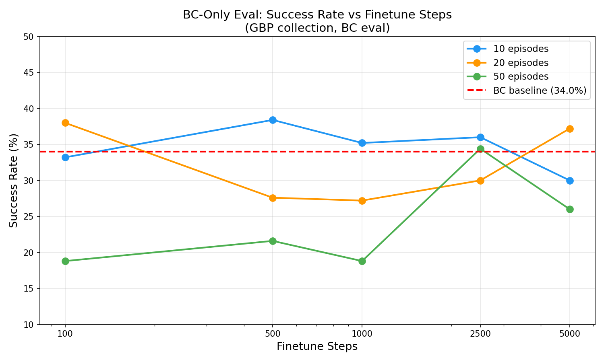
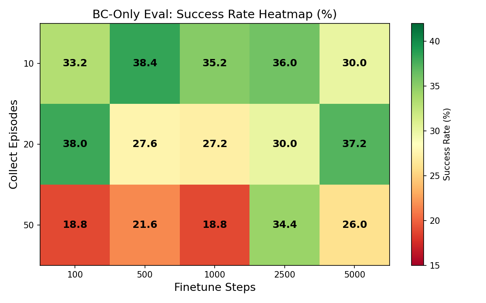
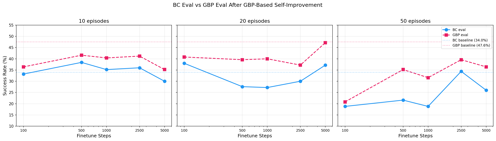
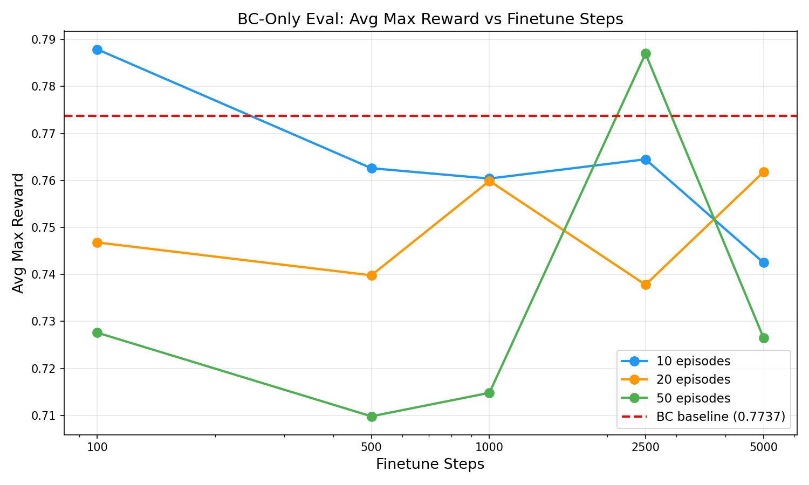

# Self-Improvement via GBP Collection with BC-Only Evaluation Baseline

## Original prompt

> Using @prompt_run_and_eval.md, basically repeat the experiments from @/storage/home/hcoda1/6/vgiridhar6/forks/lerobot/experiments/2026-04-07_self-improve-gbp-sweep, except do **not** use planning for evaluation. This experiment aims to set a baseline to the attached report. You can disable planning during eval time via `--eval_use_planning=false`.

## Research question

Does finetuning on GBP-collected on-policy episodes improve BC-only evaluation performance (without planning at test time)? This isolates whether the finetuning improves the policy itself vs. just providing a better starting point for GBP planning.

## Experiment plan

**Strategy**: Full factorial sweep identical to the prior GBP-eval experiment, but with `--eval_use_planning=false` so the finetuned model is evaluated via BC (no planning) instead of GBP. This provides a BC-eval baseline for every (n_collect_episodes, finetune_steps) combination.

**Base model**: `outputs/act_simple_awm_pusht_wm1.0_l2norm_truly_deterministic/checkpoints/100000/pretrained_model` (100K steps, BC eval = 34.0%)

**GBP params for collection** (same as prior sweep, optimal from config G7):
- `algorithm=gbp, lr=0.3, n_iters=10, action_cost_coef=0.1, convergence_tol=1e-3`

**Finetuning params** (identical to pretraining):
- `batch_size=32, lr=1e-5, optimizer=adamw, weight_decay=0.0, grad_clip_norm=10.0`

**Key change**: `--eval_use_planning=false` — final eval uses BC (no planning), while collection still uses GBP.

**Pipeline per experiment**: collect on-policy episodes with GBP -> finetune (bc_mask_mode=failure) -> final eval with **BC only** (250 episodes)

**Sweep variables**:
- `n_collect_episodes` in {10, 20, 50}
- `finetune_steps` in {100, 500, 1000, 2500, 5000}

**Baseline**: E0 — BC-only eval of unfinetuned model (no collection, no finetuning, no planning) to verify determinism against prior result of 34.0%.

**Reference points**:
- BC baseline at 100K: 34.0% success (from prior experiments)
- GBP eval at 100K (unfinetuned): 47.6% success
- Best self-improvement with GBP eval: 47.2% (E10: 20ep, 5000ft) — did NOT beat unfinetuned GBP

**Batching**: All 16 jobs submitted in parallel via SLURM.

**Stopping criteria**: Single full-factorial sweep — all experiments fully specified. No adaptive search needed.

**Compute**: `compute_rtx6000.sh` (RTX 6000, 8h time limit)

## Methodology

- **Branch**: `self-improvement-v2`
- **Compute**: `compute_rtx6000.sh` (RTX 6000 GPU nodes)
- **Execution prompt**: `prompt_run_and_eval.md`
- **Eval episodes**: 250 per experiment
- **Determinism**: `--seed=1000 --cudnn_deterministic=true`
- **WandB**: project=`awm`, entity=`pair-diffusion`
- **bc_mask_mode**: `failure` — BC loss is zeroed out on collected episodes that the policy failed
- **Collection planner**: GBP (same config as prior experiment)
- **Eval planner**: **None** (`--eval_use_planning=false`) — this is the key difference from the prior GBP-eval sweep

## Results

### Determinism verification

F0 BC baseline = **34.0%** success, avg_max_reward = **0.7737** — matches the prior result exactly. Eval pipeline is deterministic.

### Full results (BC eval)

| Experiment | n_collect_episodes | finetune_steps | Success (%) | Avg Max Reward | Eval ep/s |
|---|---|---|---|---|---|
| F0-bc-baseline-100k | -- | 0 | 34.0 | 0.7737 | 1.148 |
| F1-ep10-ft100 | 10 | 100 | 33.2 | 0.7879 | 1.120 |
| F2-ep10-ft500 | 10 | 500 | **38.4** | 0.7626 | 1.125 |
| F3-ep10-ft1000 | 10 | 1000 | 35.2 | 0.7604 | 2.664 |
| F4-ep10-ft2500 | 10 | 2500 | 36.0 | 0.7645 | 1.134 |
| F5-ep10-ft5000 | 10 | 5000 | 30.0 | 0.7425 | 1.127 |
| F6-ep20-ft100 | 20 | 100 | 38.0 | 0.7468 | 1.144 |
| F7-ep20-ft500 | 20 | 500 | 27.6 | 0.7398 | 1.138 |
| F8-ep20-ft1000 | 20 | 1000 | 27.2 | 0.7599 | 1.130 |
| F9-ep20-ft2500 | 20 | 2500 | 30.0 | 0.7378 | 1.125 |
| F10-ep20-ft5000 | 20 | 5000 | 37.2 | 0.7618 | 1.137 |
| F11-ep50-ft100 | 50 | 100 | 18.8 | 0.7276 | 1.142 |
| F12-ep50-ft500 | 50 | 500 | 21.6 | 0.7098 | 1.155 |
| F13-ep50-ft1000 | 50 | 1000 | 18.8 | 0.7148 | 1.156 |
| F14-ep50-ft2500 | 50 | 2500 | 34.4 | 0.7870 | 1.130 |
| F15-ep50-ft5000 | 50 | 5000 | 26.0 | 0.7265 | 1.124 |

### Comparison with GBP-eval sweep (prior experiment)

| n_ep | ft_steps | BC eval (%) | GBP eval (%) | GBP - BC (pp) |
|---|---|---|---|---|
| 10 | 100 | 33.2 | 36.4 | +3.2 |
| 10 | 500 | 38.4 | 41.6 | +3.2 |
| 10 | 1000 | 35.2 | 40.4 | +5.2 |
| 10 | 2500 | 36.0 | 41.2 | +5.2 |
| 10 | 5000 | 30.0 | 35.2 | +5.2 |
| 20 | 100 | 38.0 | 40.8 | +2.8 |
| 20 | 500 | 27.6 | 39.6 | +12.0 |
| 20 | 1000 | 27.2 | 40.0 | +12.8 |
| 20 | 2500 | 30.0 | 37.2 | +7.2 |
| 20 | 5000 | 37.2 | 47.2 | +10.0 |
| 50 | 100 | 18.8 | 20.8 | +2.0 |
| 50 | 500 | 21.6 | 35.2 | +13.6 |
| 50 | 1000 | 18.8 | 31.6 | +12.8 |
| 50 | 2500 | 34.4 | 39.6 | +5.2 |
| 50 | 5000 | 26.0 | 36.4 | +10.4 |

**Average GBP lift over BC eval: +7.4 percentage points** across the 15 finetuned configs.

## Key findings

- **Self-improvement does NOT improve BC eval either.** The best BC-eval result (F2: 10ep, 500ft = 38.4%) is only +4.4pp above the BC baseline (34.0%), and most configs perform *worse* than baseline. This means finetuning on GBP on-policy data mostly *hurts* the raw policy.

- **Finetuning is more damaging under BC eval than GBP eval.** In the GBP-eval sweep, 14/15 configs beat the 34.0% BC baseline. Under BC eval, only 6/15 beat it. GBP planning was *masking* policy degradation from finetuning — the finetuned policies are objectively worse, but GBP compensates at test time.

- **50 episodes is catastrophic for BC eval.** F11 (50ep, 100ft) = 18.8%, F13 (50ep, 1000ft) = 18.8% — nearly half the BC baseline. The large injection of on-policy data destroys the pretrained policy without sufficient gradient steps to recover.

- **GBP provides a consistent lift on finetuned models.** The GBP-eval result exceeds the BC-eval result in every single configuration, by +2.0pp to +13.6pp (mean +7.4pp). GBP is especially valuable when finetuning has degraded the policy — the worse the BC eval, the more GBP helps.

- **20 episodes shows erratic BC performance.** F6 (20ep, 100ft) = 38.0% is above baseline, but F7-F9 (500-2500ft) all drop to 27-30%. This suggests an unstable learning dynamic where intermediate finetuning destabilizes the policy before eventually recovering at 5000 steps (37.2%).

- **10 episodes is still the safest.** The 10-episode line stays within a relatively narrow 30-38% band, comparable to the BC baseline. The policy is minimally perturbed.

- **The GBP-eval "best" (E10: 47.2%) was almost entirely planning-driven.** The same model evaluated via BC (F10: 37.2%) scores only +3.2pp above BC baseline. The 10pp gap between BC and GBP eval shows that E10's strong performance came from test-time planning, not from an improved policy.

## Conclusions

**Finetuning on GBP-collected on-policy data does not improve the underlying BC policy.** Under BC evaluation (no planning), most finetuned models perform at or below the unfinetuned baseline of 34.0%. The apparent gains seen in the prior GBP-eval sweep were largely attributable to test-time GBP planning compensating for a degraded policy, not to genuine policy improvement.

This confirms the hypothesis from the prior experiment: finetuning with lr=1e-5 on small amounts of on-policy data disrupts the learned representations. The world model degradation hurts GBP planning (explaining why GBP eval after finetuning rarely beats unfinetuned GBP), and the action decoder also degrades (explaining why BC eval after finetuning rarely beats unfinetuned BC).

**Key implication**: To achieve genuine self-improvement (not just test-time planning gains), the finetuning procedure itself needs to be changed — e.g., freezing the world model, using a much lower LR, or collecting substantially more data.

## Stopping rationale

All 15 experiments in the full factorial design completed successfully (plus 1 baseline). The research question is answered conclusively: finetuning on GBP on-policy data does not improve BC evaluation performance. The comparison table against the GBP-eval sweep quantifies exactly how much of the prior experiment's performance came from planning vs. policy improvement. No additional experiments are needed within this parameter space.
