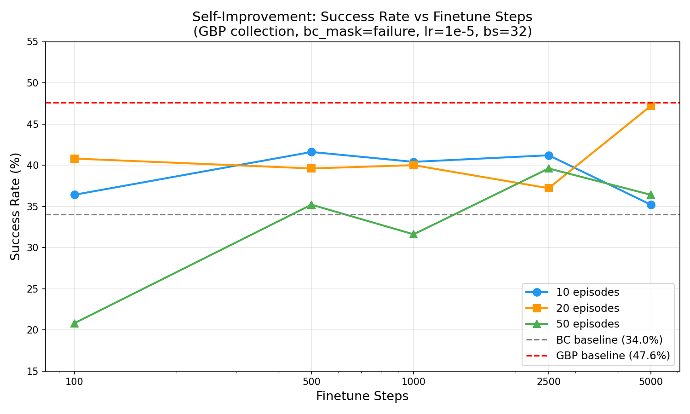
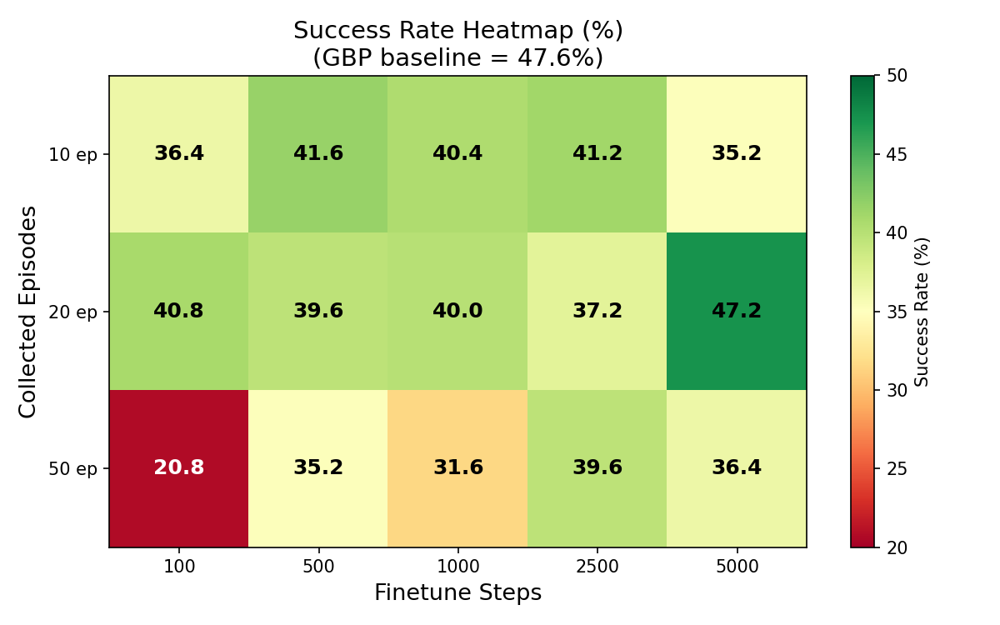
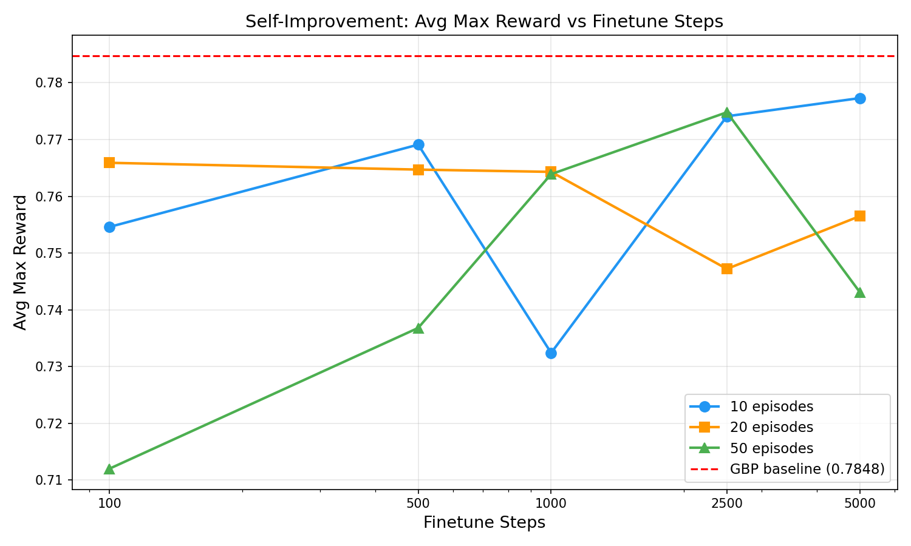

# Self-Improvement via GBP On-Policy Finetuning Sweep

## Original prompt

> Use @prompt_run_and_eval.md to test results of gradient based planning after finetuning on on-policy episodes. Base model: outputs/act_simple_awm_pusht_wm1.0_l2norm_truly_deterministic/checkpoints/100000/pretrained_model. Collect on-policy episodes via BC + GBP (select the optimal GBP parameters from the checkpoint-planning-eval report), finetune with same batch size as pretraining (32) and exact same lr (1e-05). Final eval: 250 episodes at batch size 250, seed=1000. Sweep: --n_collect_episodes {10, 20, 50} x --finetune_steps {100, 500, 1000, 2500, 5000}. Always: --use_planning=true, --bc_mask_mode=failure, --n_iters=1. Also run a fresh BC-only baseline for determinism verification.

## Research question

Can self-improvement via on-policy GBP episodes improve upon the base GBP eval performance (47.6% at 100K checkpoint)? How do the number of collected episodes and finetuning steps interact to affect final GBP-evaluated performance?

## Experiment plan

**Strategy**: Full factorial sweep — 3 n_collect_episodes x 5 finetune_steps = 15 self-improvement experiments + 1 BC-only baseline = 16 total. All submitted in parallel.

**Base model**: `outputs/act_simple_awm_pusht_wm1.0_l2norm_truly_deterministic/checkpoints/100000/pretrained_model` (100K steps, BC eval = 34.0%, GBP eval = 47.6%)

**GBP params** (optimal from checkpoint-planning-eval, config G7):
- `algorithm=gbp, lr=0.3, n_iters=10, action_cost_coef=0.1, convergence_tol=1e-3`

**Finetuning params** (identical to pretraining):
- `batch_size=32, lr=1e-5, optimizer=adamw, weight_decay=0.0, grad_clip_norm=10.0`

**Pipeline per experiment**: collect on-policy episodes with GBP -> finetune (bc_mask_mode=failure) -> final eval with GBP (250 episodes)

**Sweep variables**:
- `n_collect_episodes` in {10, 20, 50}
- `finetune_steps` in {100, 500, 1000, 2500, 5000}

**Baseline**: E0 — BC-only eval (n_iters=0, use_planning=false) to verify determinism against prior result of 34.0%.

**Reference points** (from experiments/2026-04-06_checkpoint-planning-eval):
- BC baseline at 100K: 34.0% success
- GBP at 100K: 47.6% success (this is what self-improvement should beat)

**Batching**: All 16 jobs submitted in parallel via SLURM. Well within the 30-job limit.

**Stopping criteria**: Single full-factorial sweep — all 15 + 1 experiments fully specified. No adaptive search needed.

**Compute**: `compute_rtx6000.sh` (RTX 6000, 8h time limit)

## Methodology

- **Branch**: `self-improvement-v2`
- **Compute**: `compute_rtx6000.sh` (RTX 6000 GPU nodes)
- **Execution prompt**: `prompt_run_and_eval.md`
- **Eval episodes**: 250 per experiment
- **Determinism**: `--seed=1000 --cudnn_deterministic=true`
- **WandB**: project=`awm`, entity=`pair-diffusion`
- **bc_mask_mode**: `failure` — BC loss is zeroed out on collected episodes that the policy failed, so finetuning only reinforces successful trajectories
- **Collection planner**: same GBP config used for both on-policy collection and final evaluation
- **Note**: E12 (50ep, 500ft) initially crashed with a transient filesystem I/O error and was resubmitted successfully

## Results

### Determinism verification

E0 BC baseline = **34.0%** success, avg_max_reward = **0.7737** — matches the prior result from `experiments/2026-04-06_checkpoint-planning-eval` exactly. Eval pipeline is deterministic.

### Full results

| Experiment | n_collect_episodes | finetune_steps | Success (%) | Avg Max Reward | Eval ep/s |
|---|---|---|---|---|---|
| E0-bc-baseline-100k | -- | 0 | 34.0 | 0.7737 | 1.132 |
| E1-ep10-ft100 | 10 | 100 | 36.4 | 0.7546 | 5.921 |
| E2-ep10-ft500 | 10 | 500 | 41.6 | 0.7691 | 5.964 |
| E3-ep10-ft1000 | 10 | 1000 | 40.4 | 0.7324 | 5.928 |
| E4-ep10-ft2500 | 10 | 2500 | 41.2 | 0.7741 | 5.918 |
| E5-ep10-ft5000 | 10 | 5000 | 35.2 | 0.7773 | 6.373 |
| E6-ep20-ft100 | 20 | 100 | 40.8 | 0.7659 | 5.933 |
| E7-ep20-ft500 | 20 | 500 | 39.6 | 0.7647 | 5.924 |
| E8-ep20-ft1000 | 20 | 1000 | 40.0 | 0.7643 | 5.922 |
| E9-ep20-ft2500 | 20 | 2500 | 37.2 | 0.7472 | 6.187 |
| E10-ep20-ft5000 | 20 | 5000 | **47.2** | 0.7565 | 6.196 |
| E11-ep50-ft100 | 50 | 100 | 20.8 | 0.7120 | 5.932 |
| E12-ep50-ft500 | 50 | 500 | 35.2 | 0.7368 | 5.905 |
| E13-ep50-ft1000 | 50 | 1000 | 31.6 | 0.7639 | 5.876 |
| E14-ep50-ft2500 | 50 | 2500 | 39.6 | 0.7748 | 6.001 |
| E15-ep50-ft5000 | 50 | 5000 | 36.4 | 0.7431 | 5.880 |

**Unfinetuned GBP baseline** (from prior experiment): **47.6%** success, **0.7848** avg_max_reward

## Key findings

- **Self-improvement does NOT beat the unfinetuned GBP baseline.** The best self-improvement result (E10: 20ep, 5000ft = 47.2%) falls just short of the unfinetuned GBP eval (47.6%). Every other configuration performs worse, many substantially so.

- **More collected episodes can hurt, especially with few finetune steps.** The 50-episode conditions consistently underperform. E11 (50ep, 100ft) is the worst at 20.8% — a catastrophic 27pp drop from the GBP baseline. With `bc_mask_mode=failure`, ~53% of collected episodes (the failures) have their BC loss masked. But the successful episodes still shift the data distribution, and 100 finetune steps is far too few to properly integrate 50 new episodes alongside the 25k-frame pretrain dataset.

- **10 episodes is a safer bet with a flatter curve.** The 10-episode line stays in the 35-42% range across all finetune steps, never catastrophically failing. The sweet spot appears to be around 500-2500 steps (E2=41.6%, E4=41.2%).

- **20 episodes shows the most interesting dynamics.** It starts strong at ft=100 (40.8%), dips at ft=500-2500, then spikes to 47.2% at ft=5000. This suggests 20 episodes needs substantial finetuning to properly integrate the new data.

- **All self-improvement configs beat the BC-only baseline (34.0%) except E11.** So finetuning on GBP on-policy data + GBP eval does generally improve over pure BC, just not over the unfinetuned GBP eval.

- **Avg max reward tells a different story than success rate.** Some configs with lower success rates have competitive avg_max_reward (e.g., E5: 35.2% success but 0.7773 reward; E14: 39.6% success but 0.7748 reward). The finetuned policy gets closer to success on many episodes but fails to cross the threshold.

- **The finetuning may be corrupting the world model.** The AWM head is trained jointly with the policy. Finetuning on a small number of on-policy episodes with the same lr (1e-5) may degrade the world model representations that GBP relies on for planning. This would explain why GBP eval after finetuning is worse than GBP eval on the unfinetuned model — the planner's internal model has been perturbed.

## Conclusions

**Self-improvement via single-iteration GBP on-policy collection + finetuning does not improve GBP eval performance** in this setting. The unfinetuned 100K checkpoint with GBP planning (47.6%) remains the best configuration. The closest self-improvement result (E10: 20ep, 5000ft = 47.2%) essentially matches but does not exceed it.

The failure mode appears to be that finetuning — even with `bc_mask_mode=failure` — disrupts the learned representations in a way that degrades GBP planning quality. The world model, trained jointly during pretraining, is sensitive to the distribution shift from on-policy data.

**Possible next steps** (not pursued in this experiment):
1. **Freeze the world model head** during finetuning — finetune only the action decoder, preserving the world model representations that GBP relies on.
2. **Lower the finetuning LR** — 1e-5 may be too aggressive for such a small number of new episodes. Try 1e-6 or 5e-7.
3. **Multi-iteration self-improvement** (n_iters > 1) — accumulate more data over iterations rather than finetuning on a single small batch.
4. **Use a stronger checkpoint** (200K) as the base — since GBP gains are smaller on better checkpoints, perhaps finetuning is also less disruptive.

## Stopping rationale

All 15 experiments in the full factorial design completed successfully (plus 1 baseline). The research question — whether on-policy GBP finetuning can improve GBP eval — is answered with a clear negative. No configuration in the {10, 20, 50} x {100, 500, 1000, 2500, 5000} sweep exceeds the unfinetuned GBP baseline. Further search within this parameter space is unlikely to yield different conclusions. The next steps require architectural changes (freezing the world model) or fundamentally different hyperparameter regimes (much lower LR), which are separate experiments.
