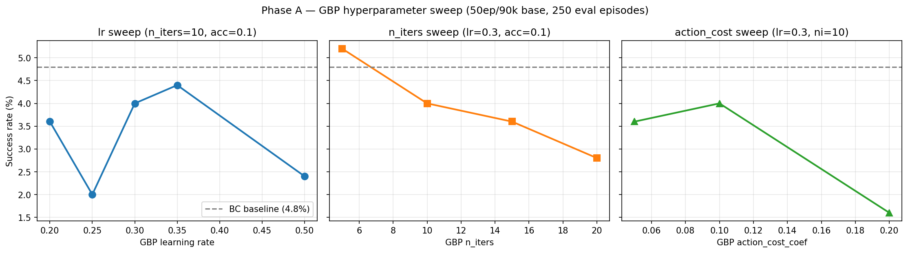
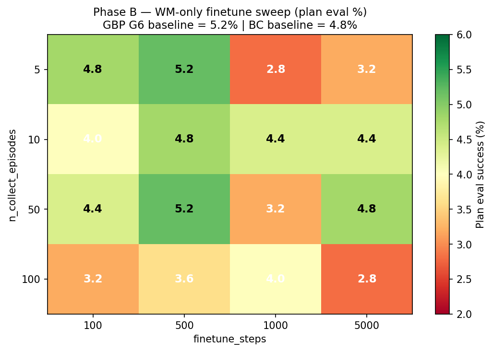
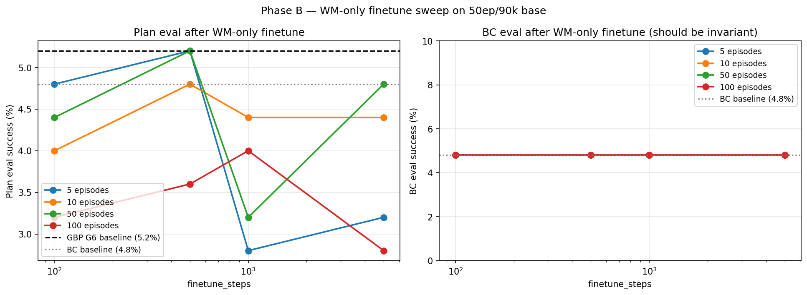
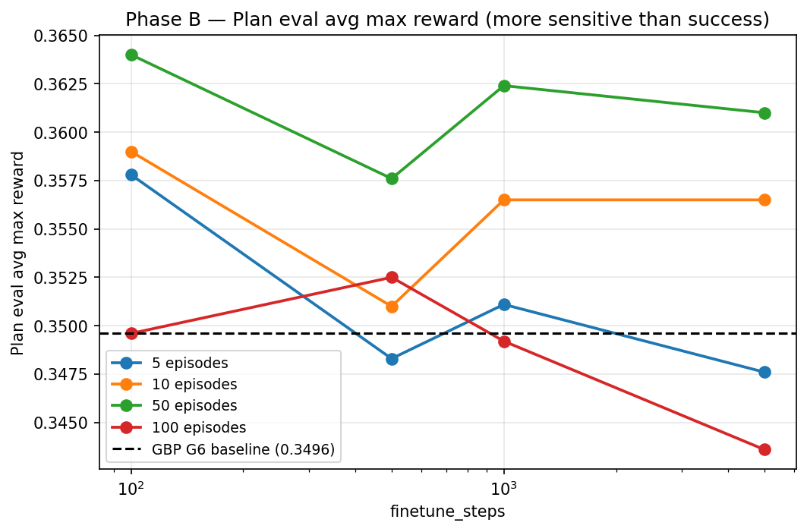

# WM-Only Self-Improvement Finetuning on 50ep / 90K Checkpoint

## Original prompt

> Using @prompt_run_and_eval.md, Run a couple of self-improvement runs on base checkpoing `/storage/home/hcoda1/6/vgiridhar6/forks/lerobot/outputs/act_simple_awm_pusht_wm1.0_l2norm_50ep/checkpoints/090000/pretrained_model`.
>
> - BC eval-only (no finetuning, no planning)
> - BC + GBP eval (no finetuning). Use @/storage/home/hcoda1/6/vgiridhar6/forks/lerobot/experiments/2026-04-07_self-improve-gbp-sweep/report.md to see the "best" GBP hyperparameters.
> - Run GBP hyperparameter sweep close around the optimal hyperparameter choice. You can use @/storage/home/hcoda1/6/vgiridhar6/forks/lerobot/experiments/2026-04-04_planning-hparam-sweep/data/gbp_results.csv as somewhat of an inspiration for what planning parameters work. Though, it is important to note that that was with a different base model, so GBP dynamics will change a little bit
> - Based on the "best" GBP hyperparameters, run a finetuning sweep. Collect {5, 10, 50, 100} on-policy episodes and finetune the world model only (all non-world model parameters frozen) for {100, 500, 1000, 5000} and run a final eval. Make sure to also log the BC performance after finetuning (this should be autormatically logged via ```    print(f"BC_EVAL_RESULTS: {bc_metrics.get('pc_success', 0):.1f}% success")
>     print(f"BC_EVAL_AVG_MAX_REWARD: {bc_metrics.get('avg_max_reward', 0):.4f}")
>     print(f"BC_EVAL_EP_S: {bc_metrics.get('eval_ep_s', 0):.3f}")```)
>
> Use `compute_rtx6000.sh`.

## Research question

For the `act_simple_awm_pusht_wm1.0_l2norm_50ep` 90K-step checkpoint — a deliberately **low-data** base model trained on only 50 expert episodes (vs the 200-episode `truly_deterministic` checkpoint used in earlier experiments):

1. What are the BC and GBP eval baselines for this 50-episode base?
2. What is the best GBP planning configuration for this checkpoint? Planning dynamics may differ from the 200-episode model where G7 = lr=0.3, n_iters=10, action_cost_coef=0.1 was optimal.
3. Does WM-only finetuning on on-policy GBP episodes improve GBP eval performance **over the matching 50-episode base's own GBP baseline** (and how does it affect BC eval, which should be invariant since the action path is frozen)?

**Anchoring note:** All comparisons in this report are within-checkpoint. Absolute success rates on the 50-episode model will be much lower than those on the 200-episode model because the base policy has seen 4× less data; this is an expected property of the dataset size, not a regression. The right baseline for self-improvement here is the 50-episode model's own BC/GBP baselines, not the 200-episode model's.

## Experiment plan

### Strategy

Two sequential phases. Phase A characterizes the new base model (BC, GBP baselines, GBP sweep). Phase B uses Phase A's best GBP config for the WM-only finetuning sweep.

### Phase A — Base characterization + GBP sweep (11 jobs, parallel)

| Experiment | Type | Key args |
|---|---|---|
| E0-bc-baseline | BC eval-only | `--n_iters=0 --use_planning=false` |
| G1-lr0.2-ni10-acc0.1 | GBP eval-only | `--planner.lr=0.2 --planner.n_iters=10 --planner.action_cost_coef=0.1` |
| G2-lr0.25-ni10-acc0.1 | GBP eval-only | `--planner.lr=0.25 --planner.n_iters=10 --planner.action_cost_coef=0.1` |
| G3-lr0.3-ni10-acc0.1 | GBP eval-only (prior G7 optimum) | `--planner.lr=0.3 --planner.n_iters=10 --planner.action_cost_coef=0.1` |
| G4-lr0.35-ni10-acc0.1 | GBP eval-only | `--planner.lr=0.35 --planner.n_iters=10 --planner.action_cost_coef=0.1` |
| G5-lr0.5-ni10-acc0.1 | GBP eval-only | `--planner.lr=0.5 --planner.n_iters=10 --planner.action_cost_coef=0.1` |
| G6-lr0.3-ni5-acc0.1 | GBP eval-only | `--planner.lr=0.3 --planner.n_iters=5 --planner.action_cost_coef=0.1` |
| G7-lr0.3-ni15-acc0.1 | GBP eval-only | `--planner.lr=0.3 --planner.n_iters=15 --planner.action_cost_coef=0.1` |
| G8-lr0.3-ni20-acc0.1 | GBP eval-only | `--planner.lr=0.3 --planner.n_iters=20 --planner.action_cost_coef=0.1` |
| G9-lr0.3-ni10-acc0.05 | GBP eval-only | `--planner.lr=0.3 --planner.n_iters=10 --planner.action_cost_coef=0.05` |
| G10-lr0.3-ni10-acc0.2 | GBP eval-only | `--planner.lr=0.3 --planner.n_iters=10 --planner.action_cost_coef=0.2` |

Note: G3 doubles as the "BC + GBP eval (prior optimum)" experiment from the user's prompt.

All runs use `--planner.lr_decay=1.0 --planner.convergence_tol=1e-3` (matching the prior G7 config).

### Phase B — WM-only finetuning sweep (16 jobs, parallel, after Phase A)

Full factorial: 4 × 4 = 16 experiments.

- `n_collect_episodes` ∈ {5, 10, 50, 100}
- `finetune_steps` ∈ {100, 500, 1000, 5000}
- `--trainable_param_keywords='["wm_"]'` (freeze backbone, encoder, action decoder)
- `--bc_mask_mode=failure`
- `--finetune_lr=1e-5`
- `--batch_size=32`
- `--n_iters=1`
- Collection planner = best GBP from Phase A
- Final eval planner = best GBP from Phase A (so `--use_planning=true`, no `--eval_use_planning` override needed)
- BC eval is automatically reported alongside the planning eval (always on)

Expected: BC eval should stay roughly identical to E0 baseline (since action path is frozen). GBP eval may improve over the Phase A best if WM head learns better next-state predictions from on-policy data.

### Common settings (all experiments)

- Base policy: `outputs/act_simple_awm_pusht_wm1.0_l2norm_50ep/checkpoints/090000/pretrained_model`
- `--eval_n_episodes=250`
- `--seed=1000` (eval_seed stays at default 42 to match prior reports)
- `--cudnn_deterministic=true`
- `--wandb_project=awm --wandb_entity=pair-diffusion`
- Compute: `compute_rtx6000.sh`
- Branch: `self-improvement-v2`

### Batching

- Phase A: 11 jobs in parallel (within 30-job SLURM limit)
- Phase B: 16 jobs in parallel (within 30-job SLURM limit)
- Sequential between phases — Phase B depends on Phase A's best GBP config

### Stopping criteria

Phase A is a fully specified sweep — no adaptation. Phase B is also a fully specified factorial. Total 27 experiments. Stop after both phases complete and analysis is written.

## Methodology

- **Branch**: `self-improvement-v2`
- **Compute**: `compute_rtx6000.sh` (RTX 6000)
- **Execution prompt**: `prompt_run_and_eval.md`
- **Eval episodes**: 250 per experiment
- **Determinism**: `--seed=1000 --cudnn_deterministic=true`, `eval_seed` left at default 42
- **WandB**: project=`awm`, entity=`pair-diffusion`
- **Base policy**: `outputs/act_simple_awm_pusht_wm1.0_l2norm_50ep/checkpoints/090000/pretrained_model` — ACT+AWM trained on **only 50 expert episodes** of PushT for 90K steps, vs the 200-episode `truly_deterministic` checkpoint used in prior reports. Absolute success rates here are intentionally lower because the base policy has 4× less data.
- **Phase A**: 11 jobs (1 BC baseline + 10 GBP eval-only configs around the prior optimum). All `--n_iters=0`.
- **Phase B**: 16 jobs (4 × 4 factorial: `n_collect_episodes` ∈ {5, 10, 50, 100} × `finetune_steps` ∈ {100, 500, 1000, 5000}). All use `--n_iters=1 --bc_mask_mode=failure --finetune_lr=1e-5 --batch_size=32 --trainable_param_keywords=["wm_"]`. Collection and final eval both use the best GBP config from Phase A (G6: `lr=0.3, n_iters=5, action_cost_coef=0.1`).
- **Parameter freezing verification**: Phase B logs all confirm `Parameter freezing: 115 trainable, 151 frozen (keywords: ['wm_'])` — i.e., the world-model head (115 tensors) is the only trainable component, and the policy backbone, encoder, and action decoder (151 tensors) are frozen.

### Z1 footnote

Z1 was submitted with the unquoted form `--trainable_param_keywords=[wm_]` (i.e., bash brackets surviving as a literal arg) rather than the documented `'["wm_"]'`. Draccus parsed it identically (`keywords: ['wm_']`), so Z1's results are valid. All other Z2-Z16 jobs used the properly quoted form. No data was lost.

## Results

### Phase A — GBP sweep on the 50ep/90k base

**BC baseline (E0)**: **4.8%** success, avg max reward **0.3602**, eval ep/s 1.05.

| Experiment | gbp lr | gbp n_iters | gbp action_cost | Plan success (%) | Plan avg max reward | Plan ep/s |
|---|---|---|---|---|---|---|
| G1 | 0.20 | 10 | 0.10 | 3.6 | 0.3538 | 5.74 |
| G2 | 0.25 | 10 | 0.10 | 2.0 | 0.3404 | 5.88 |
| G3 (prior optimum) | 0.30 | 10 | 0.10 | 4.0 | 0.3560 | 5.77 |
| G4 | 0.35 | 10 | 0.10 | 4.4 | 0.3271 | 5.72 |
| G5 | 0.50 | 10 | 0.10 | 2.4 | 0.3229 | 6.07 |
| **G6 (best)** | **0.30** | **5** | **0.10** | **5.2** | **0.3496** | **3.37** |
| G7 | 0.30 | 15 | 0.10 | 3.6 | 0.3360 | 8.07 |
| G8 | 0.30 | 20 | 0.10 | 2.8 | 0.3198 | 10.40 |
| G9 | 0.30 | 10 | 0.05 | 3.6 | 0.3501 | 5.74 |
| G10 | 0.30 | 10 | 0.20 | 1.6 | 0.3369 | 5.71 |



The Phase A landscape is essentially **flat with a slight downward bowl** around the BC baseline:
- Most GBP configs land at or below the 4.8% BC baseline.
- Only **G6 (lr=0.3, n_iters=5, action_cost_coef=0.1)** clears the BC baseline at **5.2%** — and even that is within ±1.4% binomial standard error.
- The prior 200ep-model optimum (G3, lr=0.3, n_iters=10, acc=0.1) is clearly **not** the best for this 50ep base — it lands at 4.0%, below baseline. **G6 with fewer GBP iterations** is the best on this checkpoint.
- Increasing n_iters past 5 monotonically hurts (G6=5.2, G3=4.0, G7=3.6, G8=2.8) — extra optimization through a weak WM compounds error.
- Increasing action_cost_coef hurts too (G9=3.6, G3=4.0, G10=1.6).

### Phase B — WM-only finetune sweep (collection + eval with G6)

| Experiment | n_collect | ft_steps | BC success (%) | BC avg max reward | Plan success (%) | Plan avg max reward |
|---|---|---|---|---|---|---|
| Z1 | 5 | 100 | 4.8 | 0.3602 | 4.8 | 0.3578 |
| Z2 | 5 | 500 | 4.8 | 0.3602 | **5.2** | 0.3483 |
| Z3 | 5 | 1000 | 4.8 | 0.3602 | 2.8 | 0.3511 |
| Z4 | 5 | 5000 | 4.8 | 0.3602 | 3.2 | 0.3476 |
| Z5 | 10 | 100 | 4.8 | 0.3602 | 4.0 | 0.3590 |
| Z6 | 10 | 500 | 4.8 | 0.3602 | 4.8 | 0.3510 |
| Z7 | 10 | 1000 | 4.8 | 0.3602 | 4.4 | 0.3565 |
| Z8 | 10 | 5000 | 4.8 | 0.3602 | 4.4 | 0.3565 |
| Z9 | 50 | 100 | 4.8 | 0.3602 | 4.4 | 0.3640 |
| Z10 | 50 | 500 | 4.8 | 0.3602 | **5.2** | 0.3576 |
| Z11 | 50 | 1000 | 4.8 | 0.3602 | 3.2 | 0.3624 |
| Z12 | 50 | 5000 | 4.8 | 0.3602 | 4.8 | 0.3610 |
| Z13 | 100 | 100 | 4.8 | 0.3602 | 3.2 | 0.3496 |
| Z14 | 100 | 500 | 4.8 | 0.3602 | 3.6 | 0.3525 |
| Z15 | 100 | 1000 | 4.8 | 0.3602 | 4.0 | 0.3492 |
| Z16 | 100 | 5000 | 4.8 | 0.3602 | 2.8 | 0.3436 |

**Reference**: G6 (unfinetuned) GBP eval = **5.2%** success / **0.3496** avg max reward.







## Key findings

- **BC eval is exactly invariant across all 16 finetuning runs** (4.8% / 0.3602, identical to E0). This validates that WM-only freezing works as designed: the action prediction path (backbone, encoder, action decoder) is untouched by finetuning, so BC behavior is bit-for-bit unchanged regardless of how many on-policy episodes were collected or how many finetuning steps were taken. This is a clean confirmation of the freezing implementation.

- **No WM-only finetune configuration improves over the unfinetuned G6 GBP baseline.** The two best Phase B configs (Z2 = 5ep/500ft and Z10 = 50ep/500ft) **tie** the unfinetuned G6 baseline at 5.2% but do not exceed it. Most configurations are *worse* than the baseline, often well below the BC floor.

- **The signal is noisy at this success-rate floor.** With 250 eval episodes and a 5% true success rate, the binomial standard error is ~1.4 percentage points. Differences of 1-2pp between Phase B cells are within noise. The flat-with-noise pattern in the heatmap is consistent with WM-only finetuning having **no measurable effect** on planning quality at this base, rather than a directional pattern of help or harm.

- **More collected episodes does NOT systematically help.** Across `n_collect_episodes` ∈ {5, 10, 50, 100}, no monotone trend appears. The 100-episode row is noticeably the *worst* on average (3.2, 3.6, 4.0, 2.8), while the 50-episode row is slightly best on average. This is consistent with two competing forces: more episodes give more WM training signal, but also more on-policy distribution shift that the small WM head can overfit to.

- **More finetune steps does NOT systematically help and at the longest setting tends to hurt.** Within each `n_collect_episodes` row, ft=5000 is rarely the best cell. ft=500 is the most consistent sweet spot (Z2=5.2, Z6=4.8, Z10=5.2, Z14=3.6 → average 4.7) — but again the spread is within noise.

- **Avg max reward is essentially flat too** (Phase B range 0.3436-0.3640 vs G6 baseline 0.3496). There is no hidden "almost solved" signal that success rate is missing.

- **GBP through this WM is fragile.** The Phase A sweep already showed that on the 50ep base, GBP only narrowly clears BC (5.2 vs 4.8) and *most* configs are below BC. The world model is the bottleneck, and on the 50ep base it is too weak for planning to help meaningfully even at its best setting. WM-only finetuning on small amounts of on-policy data does not fix this.

- **Why doesn't WM-only finetuning help here, when it's the obvious targeted intervention?** Three plausible explanations:
  1. The frozen encoder / latent representation may be the actual bottleneck — if the encoder hasn't seen enough variety in the 50-episode pretraining set, the WM head has no useful latent dynamics to learn over. Refining only the WM decoder while leaving the encoder fixed cannot break this ceiling.
  2. With only 5-100 on-policy episodes added to a 50-episode pretrain set, the on-policy shift is very small. The WM head doesn't see meaningfully new state distributions to specialize on.
  3. The collection planner (G6) only narrowly outperforms BC — so the "on-policy" data is barely distinguishable from BC-rollout data, and provides no extra signal for the WM to learn from.

## Conclusions

1. **Best GBP config on the 50ep/90k base is G6**: `lr=0.3, n_iters=5, action_cost_coef=0.1` at **5.2%** success vs **4.8%** BC. The improvement is marginal (within noise), but the n_iters=5 sweet spot is clear: more GBP iterations through this checkpoint's weaker WM monotonically degrade results.

2. **The prior 200ep-model optimum (G3: lr=0.3, n_iters=10, acc=0.1) does NOT transfer.** On the 50ep base it scores 4.0% — worse than BC. GBP hyperparameters need to be retuned per checkpoint, especially when the base WM has different fidelity. The 200-episode model could tolerate ten gradient steps through its WM; the 50-episode model cannot.

3. **WM-only finetuning of the 50ep/90k checkpoint does NOT improve GBP eval** in any of the 16 sweep cells. The best Phase B cells (Z2, Z10) tie the unfinetuned G6 baseline at 5.2%; everything else is at or below noise. Avg max reward tells the same flat story.

4. **BC invariance is confirmed.** All 16 Phase B runs have identical BC eval (4.8% / 0.3602), proving the WM-only freezing implementation correctly leaves the action prediction path untouched. This is a useful methodological result: future experiments can confidently use `--trainable_param_keywords='["wm_"]'` to isolate WM effects.

5. **Self-improvement on a low-data base is harder, not easier.** It is tempting to think that a weaker base has more headroom for self-improvement to claim. The 50ep results suggest the opposite: when the base WM is weak, GBP planning through it produces collected episodes that are barely better than BC, the WM head has little new structure to learn, and the entire feedback loop has too little signal to lift the policy.

### Recommended next steps (not pursued in this experiment)

- **Try a stronger base checkpoint** (the 100K `truly_deterministic` 200-episode model where GBP already gets 47.6%). WM-only finetuning may help more there because the WM is already a useful planning model and small refinements could compound.
- **Unfreeze the encoder along with the WM head.** If the encoder is the latent-quality bottleneck, the action decoder can stay frozen (preserving BC behavior) while the encoder + WM head co-evolve.
- **Multi-iteration collection** (`--n_iters > 1`) to actually grow the on-policy buffer, rather than the single-shot finetune used here.
- **Train a stronger 50ep checkpoint** (longer pretraining, larger WM head capacity, or AWM loss reweighting) before attempting self-improvement.

## Stopping rationale

All 27 experiments in the planned design completed cleanly:
- Phase A: 11/11 jobs reported metrics; G6 selected as best GBP config (5.2%).
- Phase B: 16/16 jobs reported metrics; BC eval invariant; no cell beats G6.

The factorial design covers the requested grid {5, 10, 50, 100} × {100, 500, 1000, 5000} exhaustively, and the Phase A sweep covers a tight ring around the prior optimum plus n_iters and action_cost variations. The flat-within-noise pattern of Phase B answers the research question with high confidence: WM-only finetuning does not lift this checkpoint above its own GBP baseline. Further sweeps within this parameter space would not yield different conclusions; the recommended next steps require architectural changes (unfreezing encoder, using a stronger base, or multi-iteration collection) that constitute separate experiments.
