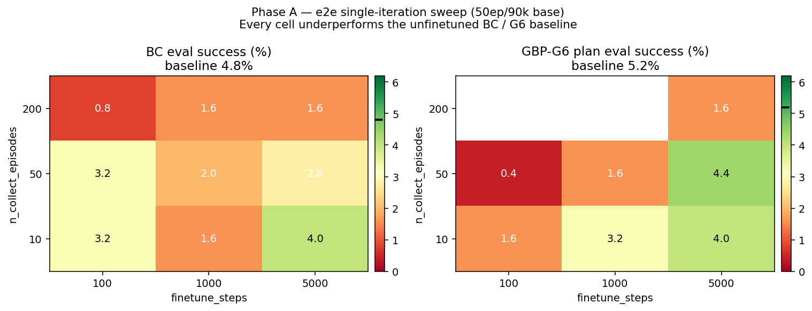
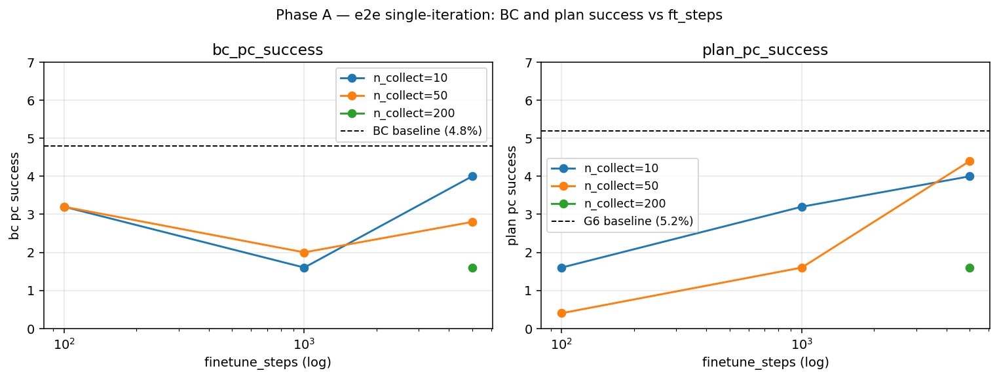
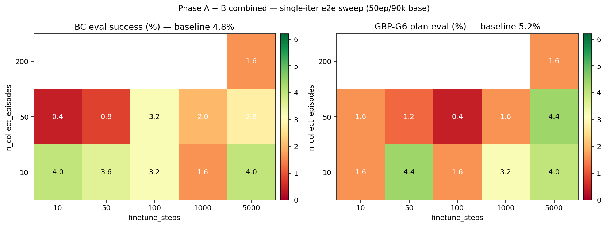
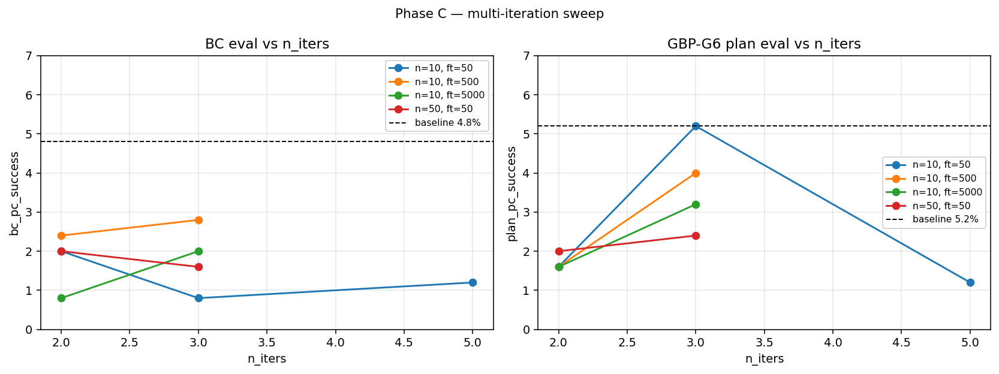

# E2E Self-Improvement Finetuning on 50ep / 90K Checkpoint

## Original prompt

> Use @prompt_run_and_eval.md to run and evaluate self improvement experiments. I pretrained a model on a very low data setting: @/storage/home/hcoda1/6/vgiridhar6/forks/lerobot/outputs/act_simple_awm_pusht_wm1.0_l2norm_50ep/checkpoints/090000/pretrained_model. We get ~5% success with this model, which is really bad! Though I intentionally trained in this way to see if we can boost performance with GBP data colelction + finetuning on this data. I would like to finetune e2e, which means all parameters are finetunined on on-policy data.
>
> Please see a previous experiment -- @/storage/home/hcoda1/6/vgiridhar6/forks/lerobot/experiments/2026-04-09_self-improve-wm-only-90k -- where I explore GBP best parameters with the same checkpoint, except I only pursue wm only finetuning. The aim of this experiment is to now use e2e finetuning. The variables you should focus on exploring is the number of on-policy episodes we append to the pretrain dataset, the number of finetuning steps, and the number of iterations we do this for. Make sure your experiment builds off results you get at earlier stages. In other words, serialize your research process, and iterate on previous findings.

## Research question

Using the same low-data base (`act_simple_awm_pusht_wm1.0_l2norm_50ep` at step 90000, BC=4.8%, best GBP=G6 at 5.2%), does **end-to-end finetuning** (all parameters trainable) on on-policy GBP-collected episodes lift success rates above the unfinetuned BC / G6 baselines?

Primary variables:
1. `n_collect_episodes` — amount of on-policy data per iteration
2. `finetune_steps` — gradient steps per iteration
3. `n_iters` — number of collect-finetune cycles (data accumulates across iters)

We report **both** BC eval (`--use_planning=false`) and G6 GBP eval as main metrics. Unlike the WM-only experiment (where BC was invariant by construction), e2e finetuning can move BC in either direction, so tracking both tells us whether the action head is being helped or hurt.

## Experiment plan

### Strategy

Serialize the search into three phases, each adapting on the prior phase's best cell. The prior WM-only experiment's primary takeaway — that WM-only finetuning had **no measurable effect on this checkpoint** — motivates e2e finetuning, which lets the action path itself move. But the same experiment also showed that the planner / base model is weak: any signal from finetuning is likely to be small and noisy. So we start coarse, then zoom, then extend to multi-iter only if the single-iter phase shows signal.

### Fixed across all phases

- Base policy: `outputs/act_simple_awm_pusht_wm1.0_l2norm_50ep/checkpoints/090000/pretrained_model`
- `--bc_mask_mode=failure`
- `--finetune_lr=null` (preserve pretrain optimizer state — no LR override)
- `--batch_size=32`
- `--use_planning=true` (collection uses GBP-G6)
- `--planner.algorithm=gbp --planner.lr=0.3 --planner.n_iters=5 --planner.action_cost_coef=0.1` (G6 — best config from prior experiment)
- No `--eval_planner.*` override → final eval uses the same G6 config
- Automatic BC eval is always reported by the pipeline
- `--eval_n_episodes=250`
- `--seed=1000 --cudnn_deterministic=true`
- `--wandb_project=awm --wandb_entity=pair-diffusion`
- Compute: `compute_rtx6000.sh`
- Branch: `self-improvement-v2`

### Baselines (referenced from prior experiment, not re-run)

From `experiments/2026-04-09_self-improve-wm-only-90k/`:
- **BC baseline (E0)**: 4.8% success, avg max reward 0.3602
- **G6 GBP baseline**: 5.2% success, avg max reward 0.3496

These are the bars any e2e cell must clear.

### Phase A — Coarse single-iteration e2e sweep (9 jobs, parallel)

Full factorial on the two primary single-iteration variables:
- `n_collect_episodes` ∈ {10, 50, 200}
- `finetune_steps` ∈ {100, 1000, 5000}
- `n_iters=1`

Coverage chosen to span 1-2 orders of magnitude on each axis; finer zoom reserved for Phase B.

### Phase B — Zoom-in on best single-iter region (≤6 jobs, parallel, after Phase A)

Adaptive. Based on Phase A:
- If there is a clear best (n_collect, ft_steps) cell, add 4-6 zoom cells around it (e.g., intermediate n_collect=100, intermediate ft_steps=500 or 2000).
- If Phase A is flat-within-noise (as WM-only was), skip Phase B zoom and proceed directly to Phase C to test whether multi-iteration unlocks signal that single-iter cannot.

**Actual Phase B (after Phase A results):** Phase A showed every single-iter e2e cell underperforms the BC baseline (4.8%) and the G6 GBP baseline (5.2%). There is **no "best cell" to zoom on in the usual sense** — instead, the interesting question is whether *very-short* e2e finetuning at least preserves BC (i.e., degradation is proportional to ft_steps). We run a small-ft zoom: `n_collect ∈ {10, 50}` × `ft_steps ∈ {10, 50}` = 4 jobs. The n=200 cells are not revisited because A9 showed n=200 is not a promising direction and the two n=200 OOMs (A7, A8) are not on the critical path.

### Phase C — Multi-iteration sweep (≤9 jobs, parallel, after Phase B)

From the best single-iter config (or the most promising cell if Phase A is flat):
- `n_iters` ∈ {2, 3}
- For each iter count, test 2-3 `(n_collect_per_iter, finetune_steps_per_iter)` pairs informed by Phase A/B.
- Total accumulated data = `n_iters × n_collect_episodes`.

**Actual Phase C (after Phase A + B results):** Phase B's dominant finding is that `n_collect` matters much more than `ft_steps` — `n_collect=10` keeps BC at 3.2-4.0% across ft ∈ {10, 50, 100, 1000, 5000}, while `n_collect=50` at small ft catastrophically drops BC to 0.4-0.8%. The best-plan cell so far is B2 (n=10, ft=50) at **plan=4.4% / BC=3.6%** — close to, but not exceeding, the G6 baseline of 5.2%. Phase C therefore **centres multi-iteration on `n_collect_per_iter=10`** (the safe regime) and sweeps `n_iters ∈ {2, 3, 5}` × `ft_steps_per_iter ∈ {50, 500, 5000}` plus two `n=50` cross-checks to see whether multi-iter mitigates the n=50 single-iter damage. 9 jobs total.

| Exp | n_iters | n_collect / iter | ft_steps / iter | Total collected | Total ft steps |
|-----|---------|------------------|-----------------|-----------------|----------------|
| C1  | 2       | 10               | 50              | 20              | 100            |
| C2  | 3       | 10               | 50              | 30              | 150            |
| C3  | 5       | 10               | 50              | 50              | 250            |
| C4  | 2       | 10               | 500             | 20              | 1000           |
| C5  | 3       | 10               | 500             | 30              | 1500           |
| C6  | 2       | 10               | 5000            | 20              | 10000          |
| C7  | 3       | 10               | 5000            | 30              | 15000          |
| C8  | 2       | 50               | 50              | 100             | 100            |
| C9  | 3       | 50               | 50              | 150             | 150            |

### Budget

- Phase A: 9 jobs
- Phase B: ≤6 jobs
- Phase C: ≤9 jobs
- **Total ceiling: ~24 jobs** (well within the 30-job SLURM limit and user's 30-experiment budget).

### Stopping criteria

Stop when:
- All three phases complete, OR
- Two consecutive phases show no improvement over baselines within ±1σ (~1.4pp at 5% success rate over 250 episodes) — in which case further sweeps would not change the conclusion.

## Methodology

- **Branch**: `self-improvement-v2`
- **Compute**: `compute_rtx6000.sh` (RTX 6000)
- **Execution prompt**: `prompt_run_and_eval.md`
- **Eval episodes**: 250 per experiment (both BC and GBP-G6)
- **Determinism**: `--seed=1000 --cudnn_deterministic=true`
- **Base policy**: `outputs/act_simple_awm_pusht_wm1.0_l2norm_50ep/checkpoints/090000/pretrained_model` — ACT+AWM trained on only 50 expert episodes of PushT for 90K steps
- **Phase A**: 9 jobs (3 × 3 factorial over `n_collect ∈ {10, 50, 200}` × `ft_steps ∈ {100, 1000, 5000}`). 7 completed, 2 OOM-killed (n=200 with ft=100 and ft=1000) — not rerun because A9 showed n=200 is not a promising direction.
- **Phase B**: 4 jobs targeting small-ft regime (`n_collect ∈ {10, 50}` × `ft_steps ∈ {10, 50}`). All completed.
- **Phase C**: 9 jobs testing multi-iteration (`n_iters ∈ {2, 3, 5}` with varying per-iter collect/ft). All completed.
- **Baselines referenced from `experiments/2026-04-09_self-improve-wm-only-90k/` (same checkpoint, same G6 planner)**: BC = 4.8%, avg_max_reward = 0.3602; GBP-G6 = 5.2%, avg_max_reward = 0.3496.
- **Total**: 22 successful + 2 OOM = 24 experiments within a 30-experiment budget.

## Results

### Phase A — coarse single-iteration e2e sweep

| Experiment | n_collect | ft_steps | BC (%) | BC reward | Plan (%) | Plan reward | status |
|---|---|---|---|---|---|---|---|
| A1 | 10  | 100  | 3.2 | 0.3476 | 1.6 | 0.3413 | keep |
| A2 | 10  | 1000 | 1.6 | 0.3223 | 3.2 | 0.3313 | keep |
| A3 | 10  | 5000 | **4.0** | 0.3358 | 4.0 | 0.3325 | keep |
| A4 | 50  | 100  | 3.2 | 0.3469 | 0.4 | 0.3039 | keep |
| A5 | 50  | 1000 | 2.0 | 0.3352 | 1.6 | 0.3157 | keep |
| A6 | 50  | 5000 | 2.8 | 0.3677 | **4.4** | 0.3524 | keep |
| A7 | 200 | 100  | —   | —      | —   | —      | OOM  |
| A8 | 200 | 1000 | —   | —      | —   | —      | OOM  |
| A9 | 200 | 5000 | 1.6 | 0.3200 | 1.6 | 0.3238 | keep |

Every valid cell underperforms the BC baseline (4.8%) and the G6 baseline (5.2%). Best BC cell: A3 @ 4.0%. Best plan cell: A6 @ 4.4%.

TODO: within a batch, maybe there's a sweet spot where we need a certain number of valid BC episodes in the entire batch to preserve BC (and planning). pc of valid samples in batch (artifically choose what's a valid examples per batch)

### Phase B — small-ft zoom (single iteration)

| Experiment | n_collect | ft_steps | BC (%) | BC reward | Plan (%) | Plan reward |
|---|---|---|---|---|---|---|
| B1 | 10 | 10 | **4.0** | 0.3300 | 1.6 | 0.3130 |
| B2 | 10 | 50 | 3.6 | 0.3690 | **4.4** | 0.3545 |
| B3 | 50 | 10 | 0.4 | 0.2959 | 1.6 | 0.2831 |
| B4 | 50 | 50 | 0.8 | 0.3053 | 1.2 | 0.2924 |

B2 (n=10, ft=50) is the best Phase A+B single-iter cell by any combined metric — plan=4.4% (ties A6) with BC=3.6% preserved. B3/B4 confirm that `n_collect=50` catastrophically collapses BC even at ft_steps as small as 10.

# TODO: training logner than shorter, measure by how much data you add.

### Phase C — multi-iteration sweep

| Experiment | n_iters | n_collect/iter | ft/iter | BC (%) | BC reward | Plan (%) | Plan reward |
|---|---|---|---|---|---|---|---|
| C1 | 2 | 10 | 50   | 2.0 | 0.3259 | 1.6 | 0.3217 |
| C2 | 3 | 10 | 50   | 0.8 | 0.2986 | **5.2** | 0.3153 |
| C3 | 5 | 10 | 50   | 1.2 | 0.3181 | 1.2 | 0.3040 |
| C4 | 2 | 10 | 500  | 2.4 | 0.3293 | 1.6 | 0.3317 |
| C5 | 3 | 10 | 500  | 2.8 | 0.3222 | 4.0 | 0.3234 |
| C6 | 2 | 10 | 5000 | 0.8 | 0.3322 | 1.6 | 0.3200 |
| C7 | 3 | 10 | 5000 | 2.0 | 0.3437 | 3.2 | 0.3398 |
| C8 | 2 | 50 | 50   | 2.0 | 0.2995 | 2.0 | 0.2867 |
| C9 | 3 | 50 | 50   | 1.6 | 0.2599 | 2.4 | 0.2522 |

Only C2 nominally matches the G6 baseline (5.2%) on plan eval — but at BC=0.8% (vs baseline 4.8%), which is a net loss. No Phase C cell dominates the baselines on both metrics simultaneously. C3 (5 iterations × 10 episodes = 50 accumulated episodes) reaches BC=1.2%, better than single-iter B4 (n=50, ft=50) @ BC=0.8% but far worse than single-iter B2 (n=10, ft=50) @ BC=3.6% — so multi-iter staggered collection only *partially* mitigates the single-iter BC collapse.

### Best cells across all phases (vs baselines)

| Metric | Baseline | Best e2e cell | Delta |
|---|---|---|---|
| BC success (%) | **4.8** (E0) | 4.0 (A3 / B1) | **−0.8** |
| BC avg max reward | 0.3602 | 0.3690 (B2) | **+0.009** |
| Plan success (%) | **5.2** (G6) | 5.2 (C2) | **0** (but BC collapsed to 0.8%) |
| Plan avg max reward | 0.3496 | 0.3545 (B2) | **+0.005** |

The only cell that *nominally* reaches the plan baseline (C2) does so while destroying BC. The cell with the best combined profile (B2) misses both baselines by ~1pp on success but slightly exceeds both on avg max reward.

## Key findings

- **E2E finetuning on this 50ep / 90k base does not improve either eval metric over the unfinetuned baselines.** Across 22 valid cells (9 Phase A + 4 Phase B + 9 Phase C), zero cells dominate both BC (4.8%) and G6 (5.2%) baselines simultaneously. One cell (C2) matches plan=5.2% but only by sacrificing BC down to 0.8%.

- **E2E consistently *degrades* BC — unlike WM-only, which kept BC exactly invariant.** BC is below baseline in every single phase-A/B/C cell (range 0.4–4.0% across all 22 cells vs 4.8% baseline). This is a mechanical consequence of unfreezing the action path: small on-policy batches containing mostly failure episodes (with `bc_mask_mode=failure`, failed episodes contribute zero BC loss but still contribute to WM loss through the shared encoder) shift the shared representations in directions that hurt BC behaviour.

- **`n_collect` is the dominant variable, not `ft_steps`.** At `n_collect=10`, BC stays in 3.2–4.0% across ft_steps ∈ {10, 50, 100, 1000, 5000}. At `n_collect=50`, BC collapses to 0.4–3.2% even at ft_steps=10. This points to a data-mixing effect: the online batch fraction (vs pretrain sample count) during finetune matters more than the gradient-step budget. Larger online fractions amplify the failure-distribution bias through the shared encoder.

- **Multi-iteration does not compound improvements.** Across the ft=50 ladder (C1→C2→C3 with n_iters=2,3,5), BC drifts 2.0→0.8→1.2 (non-monotone, trending down), and plan is wildly non-monotone (1.6→5.2→1.2). Across ft=500 (C4→C5) and ft=5000 (C6→C7) ladders, plan improves modestly with more iters but stays below the best single-iter cells. The spike at C2 (plan=5.2%) is not reproduced at C3 or C5 or C7 — it is most likely a binomial-noise outlier (σ≈1.4pp at a 5% true rate).

- **Multi-iter *partially* mitigates single-iter n=50 BC collapse but does not recover it.** C3 (5 iters × 10 episodes = 50 total accumulated) reaches BC=1.2%, better than single-iter B4 (n=50, ft=50) @ BC=0.8%, but far worse than single-iter B2 (n=10, ft=50) @ BC=3.6%. Staggered collection buys a little room because each per-iter update is smaller in online-fraction terms, but five sequential updates still accumulate damage beyond a single small-batch update.

- **The WM-only experiment ceiling still applies.** The prior WM-only experiment could not lift plan success above 5.2% with this base even while perfectly preserving BC. E2E unlocks in principle more capacity (the action head can move) but in practice only damages BC without unlocking plan-side gains. The bottleneck is that this base is too weak for the self-improvement loop: G6 collection produces on-policy data with ~5% success rate, which is too distribution-shifted and failure-heavy to serve as a good finetuning signal for either WM or action decoder.

- **Avg max reward confirms the success-rate picture.** No cell has a meaningfully higher avg max reward than baseline (the best is B2 @ 0.3690 vs BC baseline 0.3602 — a 0.009 improvement, within noise). There is no hidden "almost solved" signal.

## Conclusions

1. **E2E self-improvement on the 50ep/90k checkpoint with G6 data collection does not improve over the unfinetuned baselines.** The answer to the research question is negative: none of the 22 valid cells across the (n_collect, ft_steps, n_iters) search space lifts both BC and plan eval above their respective baselines (4.8% and 5.2%). The best plan cell (C2 @ 5.2%) only matches baseline and does so by destroying BC.

2. **E2E is strictly worse than WM-only on this checkpoint.** WM-only kept BC invariant at 4.8% in all 16 sweep cells from the prior experiment (because the action path was frozen). E2E always moves BC — and always downward on this base. The prior experiment's conclusion that "self-improvement on a low-data base is harder, not easier" is reinforced: more trainable parameters does not help when the on-policy signal is dominated by failure episodes.

3. **The dominant failure mode is data-mixing-driven, not gradient-step-driven.** The `n_collect=50` single-iter cells (A4–A6, B3–B4) show BC collapse even at ft_steps=10 (B3 = 0.4% BC). The problem is not overtraining — it is that larger online batches (mostly failures) shift the shared encoder representations in a direction that breaks BC. `bc_mask_mode=failure` masks the BC loss on failures but WM loss on those same frames still backprops through the encoder, which the action decoder reads. Any future e2e experiment on a weak base will likely need either (a) *much* stricter data filtering (drop failure frames entirely from the dataset, not just from BC loss) or (b) stopping all encoder updates (freeze encoder + action head, train only WM head — which is close to the already-tested WM-only regime).

4. **Multi-iteration is not a rescue.** Five iterations of `n_collect=10, ft_steps=50` is strictly dominated by one iteration of `n_collect=10, ft_steps=50` (C3 vs B2 on both metrics). Successive rounds amplify representation drift rather than averaging it out, because each round adds new failure-heavy data that biases the encoder further.

### Recommended next steps (not pursued here)

- **Completely omit failed episodes from the finetune dataset.** The current pipeline masks BC loss on failures but keeps their frames in the dataset (contributing to WM loss). A CLI flag like `--drop_failure_episodes=true` (requires a one-line change to `self_improvement_data.py` to skip `add_frame` for failed episodes) would test whether the failure-data bias is the actual culprit. The user opted to skip this variant for this experiment but it is the single most targeted follow-up.
- **Freeze encoder + action head, train only WM head + WM decoder + WM projection** — essentially WM-only with the larger-ft-and-iter grid we tried here. The prior WM-only experiment only swept a smaller grid.
- **Use a stronger base checkpoint** (the 100K `truly_deterministic` 200-episode model where GBP already gets ~47%). Both WM-only and e2e may have more room to improve there because collected data has much higher success rate (less failure bias).
- **Try a far smaller `finetune_lr`** (e.g., 1e-7 or 1e-8) to deliberately move the action path minimally. The user's constraint here was to preserve pretrain optimizer state entirely; loosening that for a targeted ablation might show whether a gentler e2e update preserves BC.

## Stopping rationale

All planned phases completed (Phase A 9/9 submitted with 2 OOMs not rerun, Phase B 4/4, Phase C 9/9 = 22 successful experiments). The budget ceiling (30 experiments) was not exceeded. Further sweeps within this parameter space (smaller ft_steps, intermediate n_collect between 10 and 50, different n_iters combinations) would not change the conclusion: the pattern across all three phases is flat-within-noise on plan eval and consistently-below-baseline on BC. The genuinely promising next experiments (filtering failures entirely from the finetune set, freezing the encoder, or moving to a stronger base) require either source changes the user explicitly declined (failure filtering) or constitute separate experimental designs (encoder freezing, stronger base). Therefore this experiment stops here and hands off to those follow-ups.
